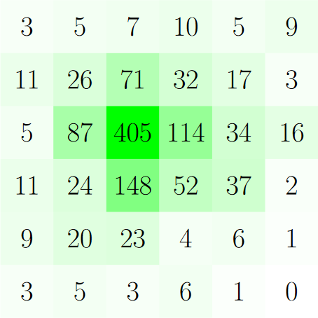

# AI for numbers from macdows 95

`requirements.txt`는 데이터를 만들어 내기 위한 CPU를 사용하는 `python` 환경이 가지는 library dependency입니다. 코드의 다른 부분에서 GPU 환경을 사용하는 경우, 일반적인 TensorFlow keras 환경에 `tqdm`을 설치하는 것으로 충분할 것입니다.

- `python train_cycle.py`를 통해 인공 신경망을 생성하고 훈련할 수 있습니다.
- `python human_play.py`를 통해 생성된 인공 신경망과 대결할 수 있습니다.
- 모델 여러 개를 `models/`(not provided)에 넣고, `python beautify_data.py`를 통해 인공지능이 어떤 수를 선호하는지를 확인할 수 있습니다.
  - 현재 비어 있는 판(81개의 가능성)에서 어떤 수를 선호하는지를 확인합니다. 이 경우 아래 그림과 비슷한 결과를 얻을 수 있습니다. (# of NN = 15, count = 1)
  - 필요한 경우 코드를 수정하시기 바랍니다.

## 성능 향상

성능이 향상된 가장 주요한 부분은 여러 기계 부품 간 data transfer overhead를 줄이는 부분입니다.

- `pv_mcts.py`에서 한 단계씩 전개하던 것을 두 단계씩 전개하도록 바꾸었습니다. 실행 시간의 큰 차이 없이[1] 노드를 몇십 배 더 볼 수 있게 되었습니다.
- 따라서, 아예 CPU로 모든 연산을 시행하게 한 후, CPU의 대수를 늘리는 방향으로 코드를 완전히 고쳤습니다. $6$코어로 실험한 결과 GPU 한 대에 비해 $3$배 정도 빠른 속도 향상을 얻을 수 있었습니다.

<small>[1] 환경에 따라 매우 크게 달라질 수 있습니다.</small>

이외에도 수리적 분석에 의한 속도 향상이 있었습니다.

- `pv_mcts.py`에서 `sum(c.n for c in self.child_nodes)`는 `self.n - 1`과 같습니다. 이는 `Node`의 시행 횟수를 업데이트할 때 항상 한 줄기를 따라 업데이트하기 때문에, (자식의 n의 합)과 (부모의 n)은 그 차이가 항상 같기 때문입니다. 실험을 통해 이 차이가 $-1$임을 알아내었습니다.
- `[x / sum(xs) for x in xs]`를 `S = sum(xs); [x / S for x in xs]`로 바꾸었습니다. `sum(xs)`는 이 계산 도중 업데이트되지 않는 값이기 때문에, 한 번만 계산하고 일괄적으로 나누는 것이 훨씬 빠릅니다.
